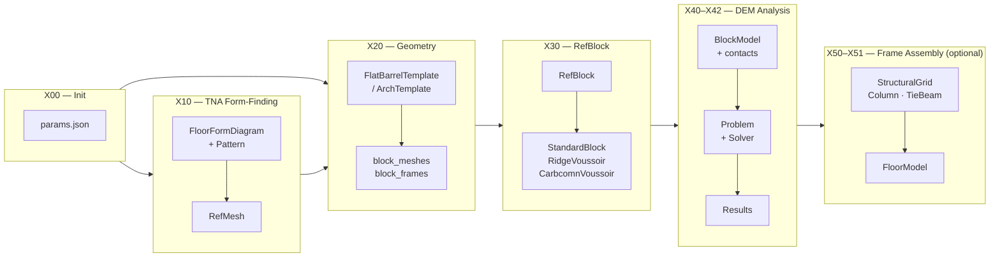
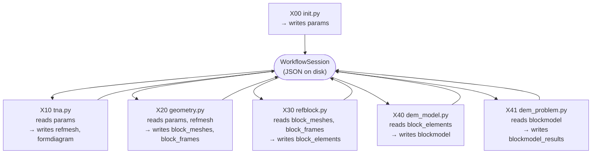
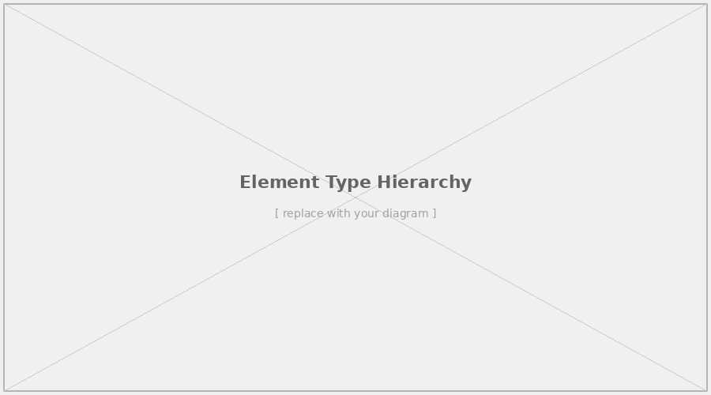

# Pipeline Overview

The `carbcomn.core` pipeline transforms a set of high-level design parameters into a fully discretised, analysis-ready structural model of the CARBCOMN floor system. It is composed of three main computational stages — **form-finding**, **geometry generation**, and **discrete element analysis** — each of which produces data that is consumed by the next.

## Stages at a Glance

## Data Flow

All intermediate data is persisted through the **`WorkflowSession`** system, which stores named Python objects as JSON files on disk. This means:

* Each pipeline stage is an independent script that reads from and writes to the session
* Any stage can be re-run in isolation without repeating previous stages
* Parameters are defined once (in the `init` script) and propagated automatically

## Script Numbering Convention

Workflow scripts follow a numbered prefix convention that makes the execution order explicit:

| Prefix | Stage                                                   |
| ------ | ------------------------------------------------------- |
| `X00`  | Init — define session and parameters                    |
| `X10`  | TNA — compute equilibrium form diagram                  |
| `X20`  | Geometry — generate block meshes and frames             |
| `X30`  | RefBlock — build typed structural elements              |
| `X40`  | DEM Model — assemble `BlockModel` and compute contacts  |
| `X41`  | DEM Problem — define and solve the mechanical problem   |
| `X42`  | DEM Visualisation — inspect results interactively       |
| `X50`  | Structural Grid — build column and beam layout          |
| `X51`  | Floor Assembly — integrate vault into full `FloorModel` |

Not every workflow uses every stage. The simpler examples (three-block test, arch) skip TNA and jump directly to geometry. See [Examples Overview](../04_examples/overview.md) for a comparison.

## Element Type Hierarchy

As the pipeline progresses from geometry to analysis, block meshes are progressively typed into structural element classes:

The element type assigned to a given block controls its geometry for DEM analysis but does not change the pipeline structure — the `BlockModel` and solver are agnostic to element type.

> **See also:** [Pipeline Reference](../03_pipeline/overview.md) for a detailed description of each stage, and [Theory](../02_theory/structural_principles.md) for the structural background.
