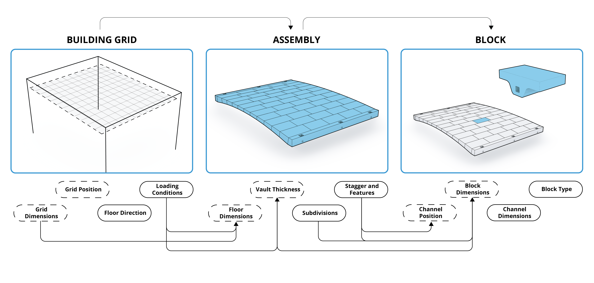
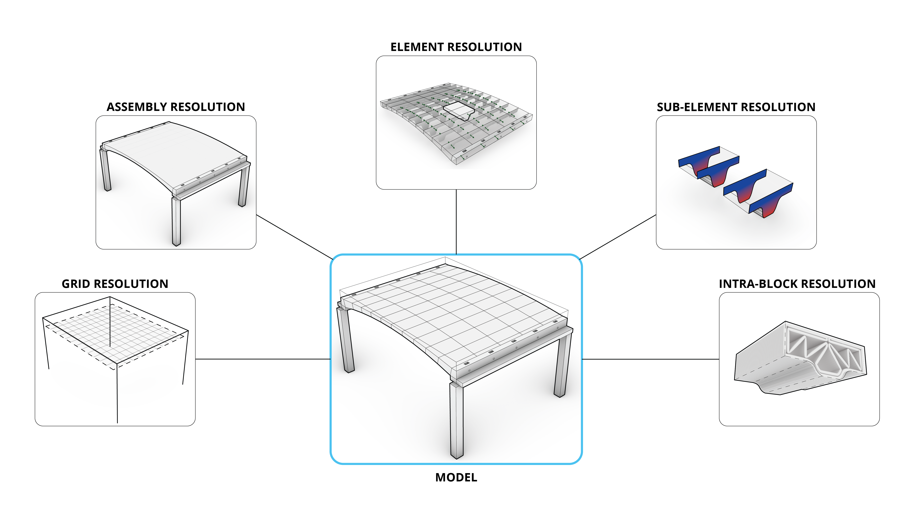

# CARBCOMN.core Architecture

## Digital Infrastructure

The CARBCOMN.core digital framework is an end-to-end computational pipeline linking design intent to prefabricated discrete components for unreinforced masonry structures. Building on BRG workflows ,and implemented in COMPAS, the framework provides an object-based, software-agnostic data backbone enabling multi-resolution derivations and traceability across multiple domains of advanced construction projects, including structural design and optimisation, fabrication, LCA and architectural design.

## Core Principles

The CARBCOMN floor system is generated through a parametric pipeline which integrates form-finding feedback, discerete element modelling into a parametric system. The main principles of this infrastructure are:

### 1 — Hierarchical Parametric Logic



The system is parameterised across **building**, **floor**, and **block** levels so that top-level decisions (e.g., grid layout and vault typology) propagate downward and constrain all downstream elements. A change to the floor span at the building level automatically conditions the TNA form-finding, the block count and dimensions at the floor level, and the individual voussoir geometry at the block level.

In `carbcomn.core` this is reflected in the `WorkflowSession` parameter dictionary, which is structured into nested levels (`grid`, `floor`, `elements`) that mirror this hierarchy:

```python
params = {
    "grid":     { "width": 6, "depth": 7.5, "height": 3.2 },   # building level
    "floor":    { "height": 0.5, "voussoirs_count_span": 20 },  # floor level
    "elements": { "column_width": 0.2, "intrados_halfwidth": 0.04 },  # block level
}
```
The relationhips between different hierarchies of elements constraints the floor system design and creates a relationship between them elements.

### 2 — Multi-resolution Representations



Elements are handled through **lightweight abstractions** (graphs, coarse meshes, parametric blueprints) during design exploration, and **explicit high-resolution geometry** (dense meshes, typed structural elements) for analysis and export. The parametric definition and topology are stored as the minimum representation; all richer geometry is derived on demand.

In the pipeline this manifests as the progression:

```
params (parametric blueprint)
    → RefMesh (equilibrium surface — coarse, graph-level)
        → block_meshes (voussoir geometry template)
            → RefBlock (parametric template carrier)
                → Block(StructuralElement) (high-resolution, analysis-ready)
                    → BlockModel contact graph (topology for solver)
```

<!-- [IMAGE PLACEHOLDER: Hierarchical and Parametric Workflow] -->


Each level adds resolution only where needed. A design exploration loop can operate entirely at the `RefMesh` level; DEM analysis requires the full `StructuralElement` geometry.

### 3 — On-demand Computation and Traceability

Expensive derivations — contact detection, DEM solving, fabrication feasibility checks — are computed only for selected design candidates, not for every parameter variation. All derived outputs remain traceable to their originating parametric definitions through COMPAS JSON serialisation and persistent GUIDs.

In practice this means the `WorkflowSession` stores every intermediate artefact in JSON serialised format. Re-running a single pipeline stage regenerates only what that stage produces, leaving all upstream artefacts intact.

## Data Model

The framework relies on a multi-resolution object model implemented in COMPAS and built on `compas_model`, organised as **hierarchical parametric entities**:

```
System
  └── Assembly (floor, grid, ...)
        └── Element (block, column, beam, ...)
              └── Interface (contact between blocks)
```


Each level carries:
- **Persistent identifiers** (GUIDs) linking derived artefacts back to their source definitions
- **Explicit connectivity** — the interface connectivity graph encodes block adjacency; the hierarchy tree encodes containment and dependencies

The **minimum stored representation** at any level comprises:
1. Parametric definitions — blueprints from which geometry is computed on demand
2. An interface connectivity graph — adjacency between elements
3. A hierarchy tree — containment and dependencies

Derived artefacts (multi-resolution geometry, analysis results, export packages) remain traceable through GUIDs and COMPAS-compatible JSON serialisation, enabling association of non-geometric project data (constraints, process metadata, results) in a software-agnostic manner.

> **Reference:** <!-- [REF: compas_model] Add compas_model reference -->

<!-- [IMAGE PLACEHOLDER: Data model diagram — System / Element / Block / Interface hierarchy with connectivity graph] -->

## Module Structure

`carbcomn.core` is organised into five sub-packages that map directly onto the pipeline stages:

```
src/carbcomn/
├── session/          ← WorkflowSession — persistent parameter and data store
├── datastructures/   ← RefMesh, RefBlock, FloorFormDiagram, Pattern
│                        (lightweight, parametric representations)
├── templates/        ← Parametric geometry generators
│                        FlatBarrelTemplate, ArchTemplate, ...
│                        (form → block_meshes, block_frames)
├── model/            ← Typed structural elements and assembly models
│   ├── elements/
│   │   ├── blocks/   ← StandardBlock, RidgeVoussoir, CarbcomnVoussoir
│   │   ├── beams/    ← TieBeam
│   │   └── columns/  ← Column
│   ├── floor.py      ← FloorModel
│   ├── grid.py       ← StructuralGrid
│   └── modifiers/    ← TrimModifier
├── equilibrium/      ← TNA equilibrium computation (wraps compas_tna)
├── exchange/         ← Import/export utilities
└── viewer/           ← Viewer extensions (wraps compas_viewer)
```

### From templates to model — the element generation logic

The transition from lightweight parametric geometry to analysis-ready typed elements follows a deliberate three-stage pattern:

**Stage 1 — Template** (`carbcomn.templates`)
The template takes a `RefMesh` and discretisation parameters and produces `block_meshes` and `block_frames` — raw geometry without structural typing. This is the cheapest representation and is used for design exploration.

**Stage 2 — RefBlock** (`carbcomn.datastructures`)
`RefBlock` wraps a block mesh together with its reference frame and grid position. It is the pivot between geometry and element type: the same `RefBlock` can be instantiated as any element type without recomputing the geometry.

**Stage 3 — StructuralElement** (`carbcomn.model`)
The element type (`StandardBlock`, `RidgeVoussoir`, `CarbcomnVoussoir`) is determined here. Each type computes its own high-resolution model geometry from the `RefBlock`, adding features (ridge, cable slot) beyond the raw mesh. This geometry is what the DEM solver operates on.

<!-- [IMAGE PLACEHOLDER: Three-stage progression diagram — Template → RefBlock → StructuralElement, with geometry at each stage] -->

## Inputs and Outputs

### Inputs

The framework receives:
- **Typology and layout** — floor plan dimensions, vault type, grid configuration
- **Boundary conditions and load envelope** — support positions, applied loads, self-weight parameters
- **Geometric bounds** — thickness, rise, block count, stagger type and amount
- **Discretisation controls** — block size limits, density, interface assumptions
- **Fabrication constraints** — minimum feature resolution, admissible overhangs, handling constraints
- **Optional optimisation objectives** — minimise mass, block count, or thrust

### Outputs

For each design variant, the pipeline produces:
- **Assembly topology and interface connectivity** — the contact graph
- **Multi-resolution geometry** — from coarse `RefMesh` to high-resolution `StructuralElement` meshes
- **Structural evaluation data** — equilibrium results, interface force metrics, form-found diagrams
- **Fabrication feasibility indicators** — referenced within fabrication-ready element definitions

Together, these inputs and outputs define the pipeline content while allowing integration of additional domain data (e.g., LCA metrics or monitoring streams) through COMPAS JSON serialisation.

> **See also:** [Pipeline Architecture](../03_pipeline/overview.md), [COMPAS Framework](compas_framework.md)
