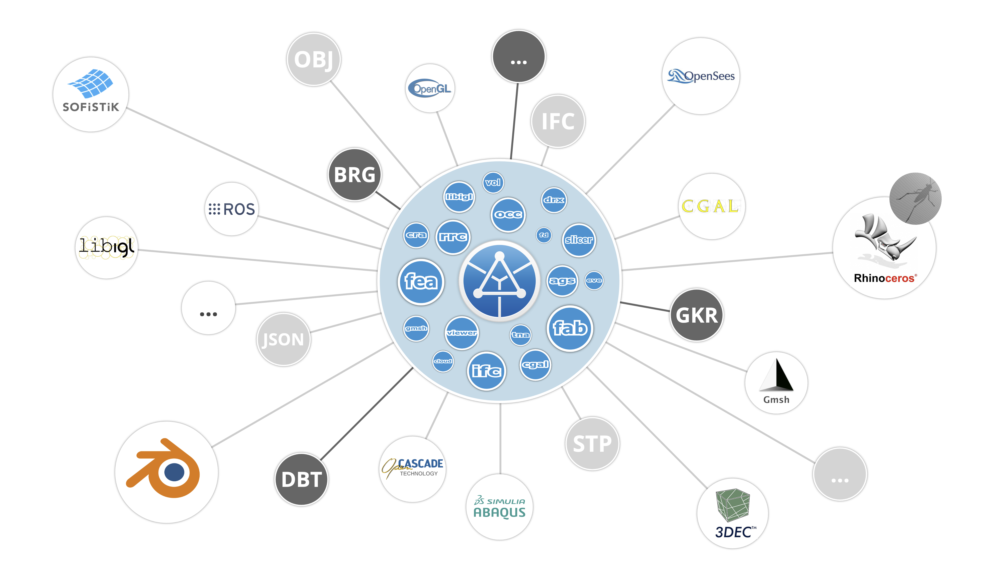

# COMPAS Framework

## What is COMPAS?

**COMPAS** is an open-source computational framework for research in architecture, engineering, and fabrication, developed at the Block Research Group (BRG) at ETH Zurich and collaborating institutions[^1]. It provides a software-agnostic, Python-based data backbone for geometric computation, data structures, and numerical methods, with interfaces to a wide range of external tools and solvers.

## Why CARBCOMN uses COMPAS

The CARBCOMN pipeline is implemented entirely within the COMPAS ecosystem. This choice provides several key advantages:

- **Software-agnostic data model** — COMPAS objects serialise to and from JSON without dependency on any CAD or analysis platform, meaning pipeline outputs can be consumed by Rhino, Blender, or any Python environment equally
- **Interoperability** — COMPAS provides standardised interfaces to external solvers (TNA, DEM, FEM) without locking the pipeline to a single backend
- **Traceability** — all derived artefacts (geometry, analysis results, export packages) remain traceable to their originating parametric definitions through COMPAS-compatible JSON serialisation and GUIDs
- **Research ecosystem** — BRG's existing libraries for TNA, DEM, and model management are all COMPAS-native, enabling direct reuse without translation layers

## Key packages used in CARBCOMN.core

| Package | Role in the pipeline |
|---------|---------------------|
| `compas` | Core geometry, data structures, JSON serialisation |
| `compas_tna` | Thrust Network Analysis — form-finding |
| `compas_dem` | Discrete Element Method — block models, contact detection, solver interfaces |
| `compas_model` | Hierarchical parametric object model (`System → Element → Block → Interface`) |
| `compas_viewer` | Interactive 3D visualisation of geometry and analysis results |
| `compas_cgal` | Computational geometry operations (contact polygon computation) |
| `compas_cra` | CRA solver (Contact and Rigid-body Analysis) |
| `compas_rbe` | RBE solver (Rigid Body Equilibrium) |
| `compas_lmgc90` | LMGC90 solver bindings |
| `compas_occ` | OpenCASCADE geometry kernel integration |

## compas_model — the object backbone

The data model underlying `carbcomn.core` is built on **`compas_model`**, which manages geometric assemblies using complementary data structures:

- A **hierarchy tree** encoding containment and dependencies between elements (`System → Element → Block`)
- An **interface connectivity graph** encoding adjacency between elements at the contact level

The minimum stored representation at any level comprises:
1. Parametric definitions (blueprints from which geometry is computed on demand)
2. An interface connectivity graph (adjacency)
3. A hierarchy tree encoding containment and dependencies

This design allows lightweight representations to be used during design exploration, with high-resolution geometry computed only when needed for analysis or export[^2].

## COMPAS JSON serialisation

All CARBCOMN pipeline data — geometry, model objects, analysis results — is persisted through COMPAS's JSON serialisation system. Every COMPAS object implements `__data__` (serialisation) and `__from_data__` (deserialisation), making it round-trippable through a standard JSON file without loss of type information.

This is the mechanism behind the `WorkflowSession`: when `session.sync()` is called, it calls `compas.json_dump()` on each stored object, which recursively serialises the full object graph to a single JSON file. Reading back with `compas.json_load()` reconstructs the original Python objects with their correct types.

> **See also:** [Session & Parameter Management](../03_pipeline/session.md)

[^1]: Van Mele, T., Liew, A., Méndez Echenagucia, T., Dell'Endice, A., Pastrana, R., Doménech-Rodríguez, C., Huang, S., Paulson, N., Ranaudo, F., Joris, I., Carneau, P., Bürgin, T., Ongaro, G., Cagan, D., & Iszatt, J. (2022). *COMPAS: A framework for computational research in architecture and structures*. ETH Zürich. https://doi.org/10.5281/zenodo.7317703
[^2]: Van Mele, T. et al. (2023). *compas_model: A hierarchical data model for assemblies and structures*. Block Research Group, ETH Zürich. https://github.com/BlockResearchGroup/compas_model
