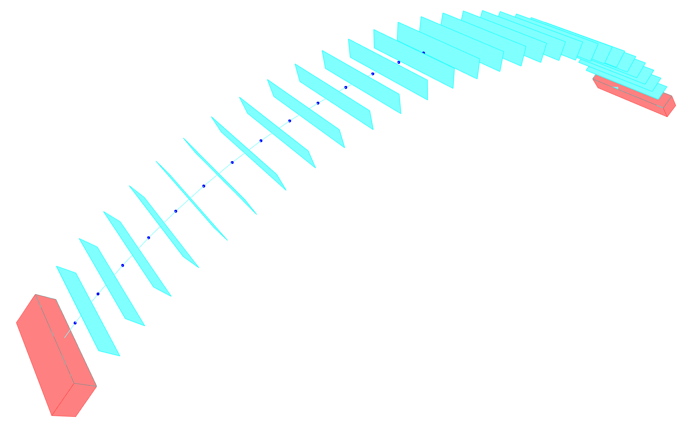

# Step 4 — DEM Model Assembly

**Script prefix:** `X40`\
**Session inputs:** `session["block_elements"]` (typed workflows) or `session["block_meshes"]` (standard-block workflows)\
**Session outputs:** `session["blockmodel"]`

## Purpose

The DEM model step assembles all block elements into a `BlockModel` and **computes the contact interfaces** between adjacent blocks. The result is a complete discrete-element model, with the mesh block elements and their contact interfaces stored in a contact graph, where nodes represent blocks and edges represent detected interfaces.

## Building the BlockModel

```python
from compas_dem.models import BlockModel
from carbcomn.model.elements.structural import StructuralElement

model = BlockModel()

for i in range(len(blocks)):
    for j in range(len(blocks[i])):
        block = blocks[i][j]
        model.add_element(block)

model.compute_contacts()

session["blockmodel"] = model
session.sync()
```

For simpler workflows (examples `200`, `300`) that do not use the RefBlock step, block meshes are passed directly:

```python
model = BlockModel.from_meshes(block_meshes_flat)
model.compute_contacts()
```

## Contact detection

`model.compute_contacts()` performs a geometric search over all block pairs to find adjacent blocks and compute their shared interface geometry. For each detected contact:

1. The contact type is identified: Currently only face-to-face (a polygon) contacts are detected inside COMPAS.
2. The shared interface polygon is computed from the intersection of the two adjacent block faces
3. The interface is discretised into contact points where forces are applied and resolved

The contact graph is stored on `model.graph`.

## Inspecting the contact graph

After running `compute_contacts()`, the model topology can be visualised to verify that all expected contacts were detected:

```python
# Nodes: block elements
for node in model.graph.nodes():
    element = model.graph.node_element(node)
    print(node, element.name, element.is_support)

# Edges: contact interfaces
for contact in model.contacts():
    print(contact.mesh)   # the interface polygon mesh
```

In the viewer, support blocks are shown in red and non-support blocks in light grey. Contact polygons are shown in cyan. The contact graph edges are shown as magenta lines connecting block centroids.



## Supports

Each block has an `is_support` attribute that flags it as a boundary condition. Support blocks are held fixed during analysis; the flag is carried through into the problem definition automatically.

> **See also:** [Step 5 — DEM Problem & Solvers](dem_problem_step.md), [DEM Theory](../02_background/discrete_element_modelling.md)
