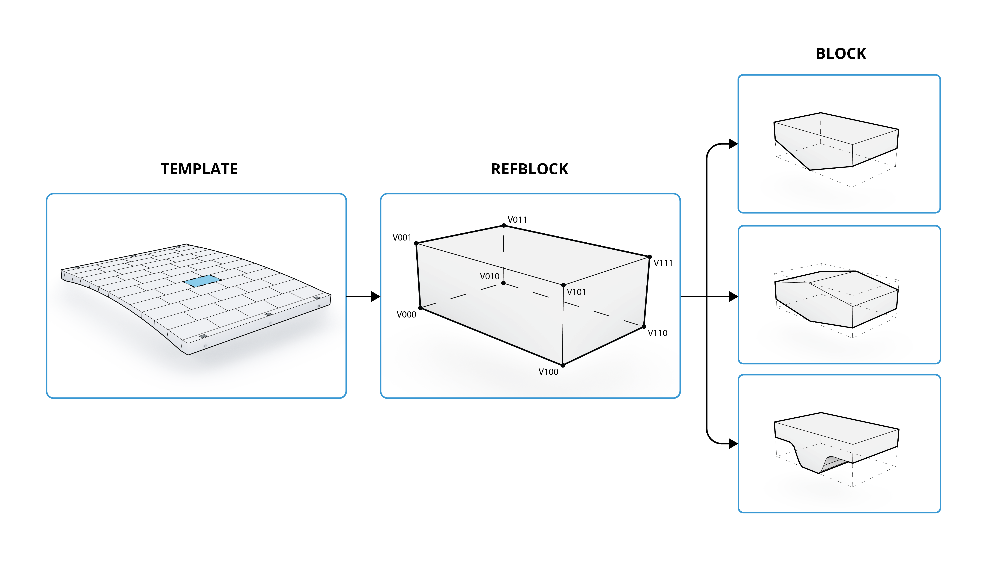

# Step 3 — RefBlock & Element Typing

**Script prefix:** `X30`\
**Session inputs:** `session["params"]`, `session["refmesh"]`, `session["block_meshes"]`, `session["block_frames"]`\
**Session outputs:** `session["refblocks"]`, `session["block_elements"]`

## Purpose

The RefBlock step converts the raw block meshes produced by geometry generation into **typed structural element objects**. This is where the decision of which blocks become `StandardBlock`, `RidgeVoussoir`, or `CarbcomnVoussoir` elements is made, controlled by the `"feature_cols"` parameter.

This step is only present in workflows that use typed elements (examples `400` and `500`). Simpler workflows that use only `StandardBlock` elements can skip this step and pass block meshes directly to the DEM model step.

## The RefBlock intermediate

A `RefBlock` is an intermediate data structure that wraps a block mesh together with its **reference frame** and **position in the vault grid** (column index, row index). It decouples the geometry from the element type: the same `RefBlock` can be instantiated as any element type. The `RefBlock`enables the exploration of various Voussoir geometries in a normalised parametric space.



```python
from carbcomn.datastructures.refblock import RefBlock

# RefBlocks are normally produced by the template, but can be inspected individually:
rb = refblocks[i][j]   # RefBlock at column i, row j
rb.frame               # local coordinate frame of the block
rb.mesh                # the block mesh geometry
```

## Code walkthrough

```python
from carbcomn.model.elements.blocks.ridge_voussoir import RidgeVoussoir
from carbcomn.model.elements.blocks.standard_block import StandardBlock

feature_cols = params["floor"]["feature_cols"]   # e.g. [0, 2, 4, 6]
refblocks = session["refblocks"]

block_elements = []

for i in range(len(refblocks)):
    col_elements = []
    for j in range(len(refblocks[i])):
        rb = refblocks[i][j]

        # First and last row are supports (resting on tie-beams)
        is_support = (j == 0) or (j == len(refblocks[i]) - 1)

        # Assign element type based on column index
        if i in feature_cols:
            element = RidgeVoussoir.from_refblock(
                refblock=rb,
                is_support=is_support,
                name=f"block_{i}_{j}",
            )
        else:
            element = StandardBlock.from_refblock(
                refblock=rb,
                is_support=is_support,
                name=f"block_{i}_{j}",
            )
        col_elements.append(element)
    block_elements.append(col_elements)

session["block_elements"] = block_elements
session.sync()
```

For the `CarbcomnVoussoir` variant (example `500`), the inner branch becomes:

```python
from carbcomn.model.elements.blocks.carbcomn_voussoir import CarbcomnVoussoir

element = CarbcomnVoussoir.from_refblock(
    refblock=rb,
    is_support=is_support,
    name=f"block_{i}_{j}",
)
```

## Support assignment

Blocks whose row index is `0` or `len(col) - 1` (i.e. the first and last blocks in each column) are flagged as `is_support=True`. These are the blocks that rest on the tie-beams and transmit the vault's reactions to the structural frame. The DEM solver treats support blocks as kinematically fixed by default.

## Element geometry computation

Each element type computes its own **model geometry** — the mesh that will be used for contact detection — from the `RefBlock` geometry. For `StandardBlock` this is simply the original mesh; for `RidgeVoussoir` and `CarbcomnVoussoir` it includes the additional geometric features (ridge, cable slot) derived from the reference block dimensions.

```python
# Inspect the computed geometry before running DEM
element.compute_elementgeometry()   # returns the typed Mesh
element.modelgeometry               # the same, as a property
```

> **See also:** [The CARBCOMN Voussoir (Theory)](/broken/pages/U7ccoSYOu27Jj5q78X2F), [Example 400](../04_examples/400_floor_stag_ridge.md), [Example 500](../04_examples/500_floor_stag_carbcomn.md)
