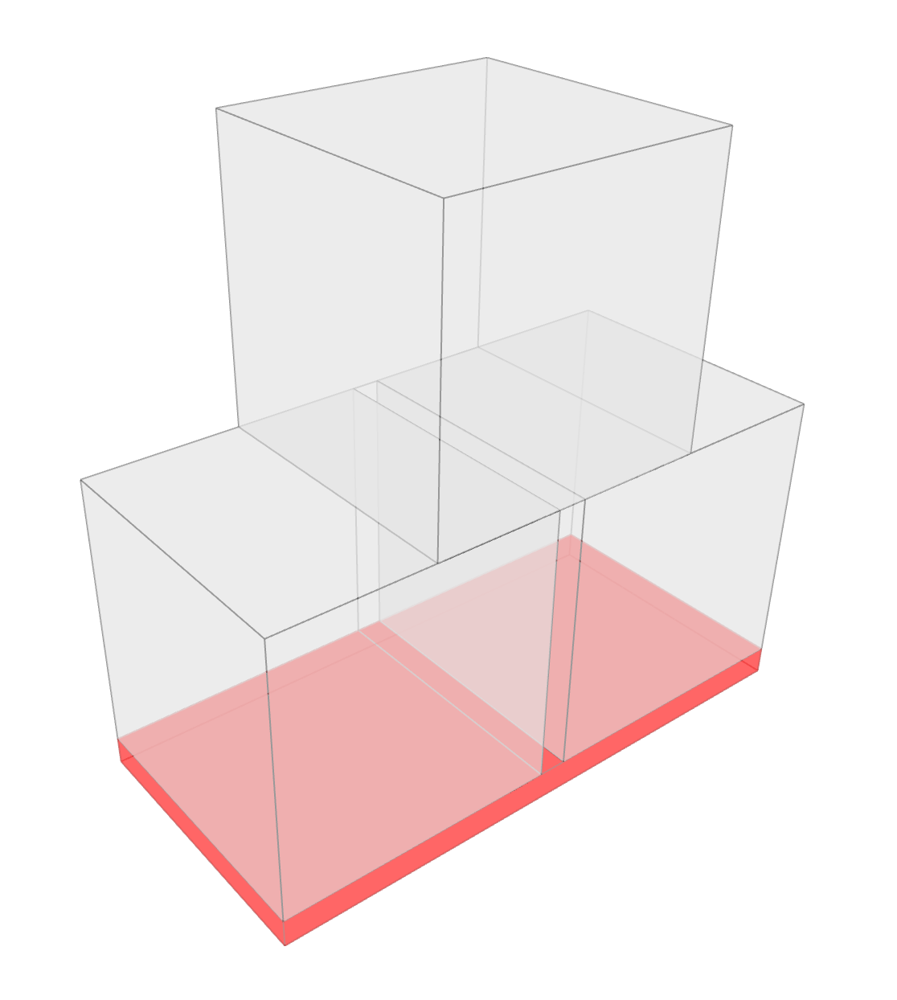
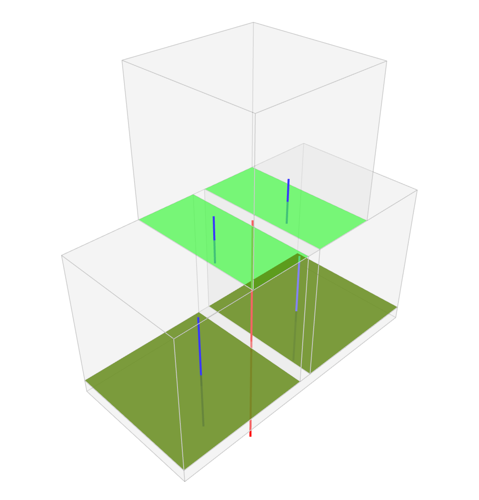
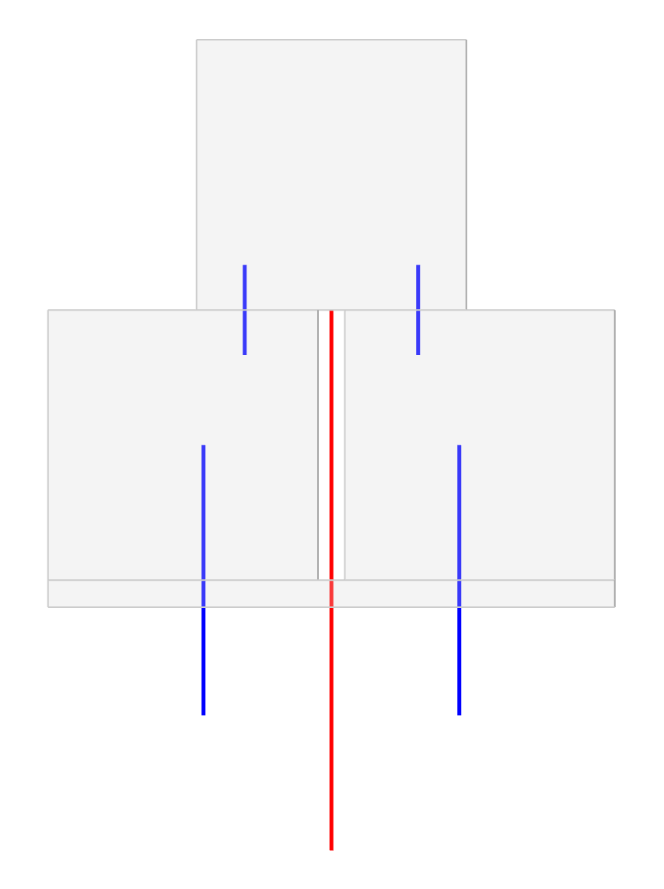

# 000 — Three Blocks

**Session name:** `threeblocks`\
**Folder:** `examples/workflows/testing_dem/000_threeblocks/`

## Goal

The simplest possible DEM test: **two base blocks supporting one block on top**. This workflow exists to validate the entire pipeline from geometry creation through to solver and result inspection, without any architectural or structural complexity getting in the way.



## Concepts introduced

* **`WorkflowSession`** — creating a session, writing parameters with `session["params"] = params`, persisting to disk with `session.sync()`, and reading in a downstream script with `params = session["params"]`
* **Direct geometry construction** — blocks created as `compas.geometry.Box` objects without any template or TNA step; the lowest-level entry point into the pipeline
* **`BlockModel.from_boxes()`** — building a `BlockModel` directly from a list of box primitives
* **Automatic contact detection** — `model.compute_contacts()` identifies contacts by geometry
* **Support assignment by position** — blocks with centroid below a z-threshold are flagged as supports
* **Solver comparison** — the same problem solved with LMGC90 and CRA in separate scripts

## Workflow steps

| Script                     | Stage                  | Description                                                           |
| -------------------------- | ---------------------- | --------------------------------------------------------------------- |
| `000_init.py`              | X00 Init               | Create session, write block dimensions and camera params              |
| `020_geometry.py`          | X20 Geometry           | Build three `compas.geometry.Box` objects                             |
| `021_geometry5vertices.py` | X20 Geometry (variant) | Same with a 5-vertex polygon cross-section                            |
| `040_dem_model.py`         | X40 DEM Model          | `BlockModel.from_boxes()`, `compute_contacts()`, assign supports by z |
| `041_dem_problem.py`       | X41 DEM Problem        | Define `Problem`, `MohrCoulomb` contact model                         |
| `042_SW_Analysis.py`       | X41 DEM Problem        | Solve with LMGC90                                                     |
| `043_SW_Analysis_cra.py`   | X41 DEM Problem        | Solve with CRA                                                        |
| `044_SW_Viz.py`            | X42 Visualisation      | Load results, print reactions, verify equilibrium                     |

## Key code snippets

### Init — defining the session and parameters

```python
from carbcomn.session import WorkflowSession

session = WorkflowSession(name="threeblocks")

params = {
    "viewer": {"unit": "m", "camera": {"position": [-3.5, -4.0, 4.0], "target": [0, 0.5, 0.5]}},
    "blocks": {"Width": 1.0, "Height": 1.0, "Gap": 0.1},
    "problem": {},
}

session["params"] = params
session.sync()
```

### Geometry — direct box construction

```python
import compas.geometry as cg

width = params["blocks"]["Width"]
height = params["blocks"]["Height"]
gap = params["blocks"]["Gap"]
total_w = 2 * width + gap

base_left  = cg.Box.from_corner_corner_height([0, 0, 0],          [width, width, 0],     height)
base_right = cg.Box.from_corner_corner_height([width+gap, 0, 0],  [total_w, width, 0],   height)
top        = cg.Box.from_corner_corner_height([top_x, 0, height], [top_x+width, width, height], height)

session["block_meshes"] = [base_left, base_right, top]
session.sync()
```

### DEM Model — from boxes, supports by position

```python
from compas_dem.models import BlockModel

model = BlockModel.from_boxes(blocks)
model.compute_contacts()

for block in model.elements():
    if block.point.z < 0.1:   # threshold: blocks at ground level are supports
        block.is_support = True

session["blockmodel"] = model
session.sync()
```

## What to observe

After running `044_SW_Viz.py`, the total reaction force at the two support blocks should equal the self-weight of the top block. This is the simplest equilibrium check available in the pipeline and confirms that the solver, contact model, and material assignment are all working correctly.

 
