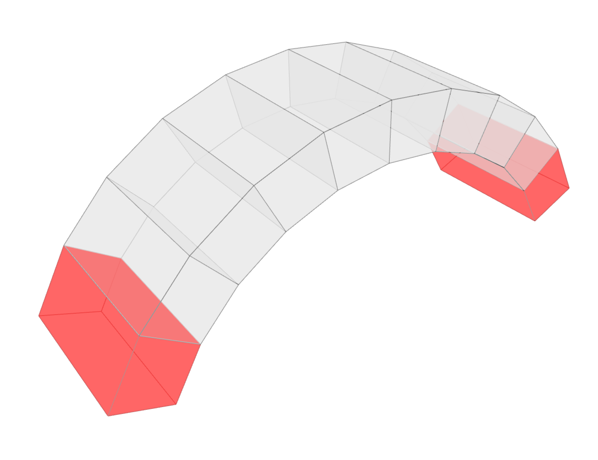
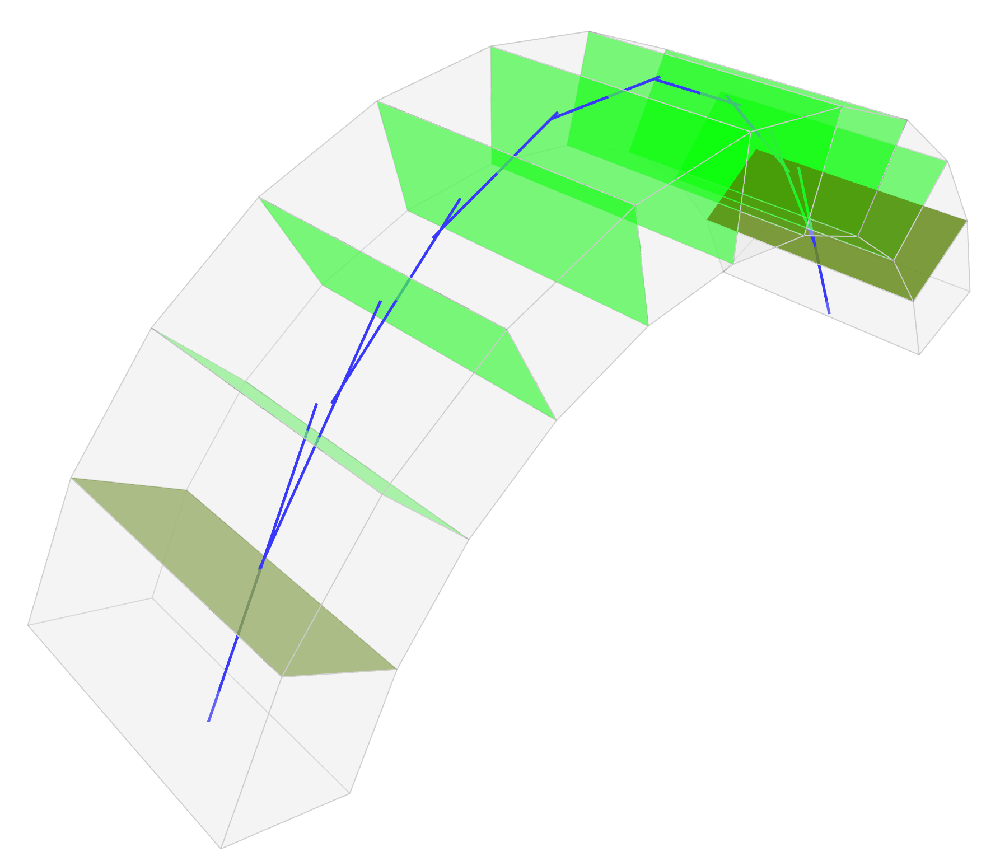
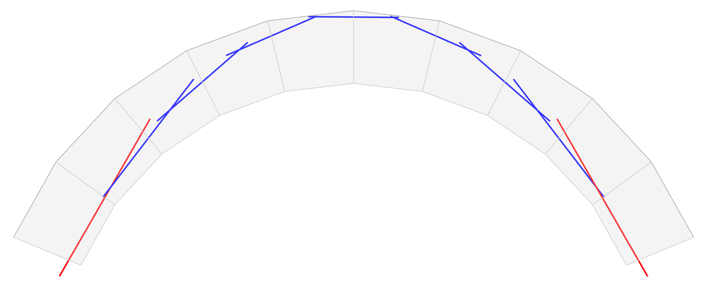

# 100 — Arch

**Session name:** `ArchTest`\
**Folder:** `examples/workflows/testing_dem/100_arch/`

## Goal

A **semi-circular arch of ten voussoirs**. This workflow introduces the `ArchTemplate` for parametric geometry generation, the `MohrCoulomb` friction contact model, and **support displacement load cases** for driving the arch toward its minimum and maximum thrust states.



## Concepts introduced

* **`ArchTemplate`** — parametric voussoir geometry from rise, span, depth, thickness, and block count; no `RefMesh` or TNA required
* **`MeshGeometryElement`** — explicit per-element construction with manual `is_support` assignment
* **`MohrCoulomb` contact model** — friction-only contact law (φ, c), appropriate for dry-stone masonry
* **Multiple solvers on the same model** — LMGC90 and CRA scripts run identically except for the solver choice
* **Support displacement** — prescribing a horizontal inward displacement to one support to drive the arch toward collapse; demonstrates min/max thrust analysis

## Workflow steps

| Script                      | Stage             | Description                                                             |
| --------------------------- | ----------------- | ----------------------------------------------------------------------- |
| `100_init.py`               | X00 Init          | Session, arch geometry params (span, rise, depth, thickness, n\_blocks) |
| `120_geometry.py`           | X20 Geometry      | `ArchTemplate` → block meshes                                           |
| `140_dem_model.py`          | X40 DEM Model     | Assemble `BlockModel`, assign first/last blocks as supports             |
| `141_dem_problem_LMGC90.py` | X41 DEM Problem   | Self-weight, LMGC90 solver                                              |
| `142_dem_problem_CRA.py`    | X41 DEM Problem   | Self-weight, CRA solver                                                 |
| `143_dem_results.py`        | X42 Visualisation | Load and inspect results                                                |
| `144_Max_Thrust.py`         | X41 DEM Problem   | LMGC90 + inward support displacement → max thrust state                 |
| `145_Min_Thrust.py`         | X41 DEM Problem   | LMGC90 + inward support displacement → min thrust state                 |

## Key code snippets

### Geometry — parametric arch

```python
from carbcomn.templates.arch import ArchTemplate

template = ArchTemplate(
    span=3.0,       # [m]
    rise=1.5,       # [m]
    depth=0.5,      # voussoir depth (out-of-plane) [m]
    thickness=0.3,  # voussoir thickness [m]
    n_blocks=10,    # number of voussoirs
)

block_meshes = template.blocks
```

### DEM Problem — MohrCoulomb contact model

```python
from compas_dem.problem import Problem, Solver

problem = Problem(model)
problem.add_contact_model("MohrCoulomb", phi=35, c=0)  # dry joint
problem.add_supports_from_model()

solver = Solver.LMGC90()
problem.solve(solver)
```

### Support displacement — minimum thrust

```python
# Drive arch toward minimum thrust by pushing one support inward
problem.add_support_displacement(support_index=0, displacement=[0.01, 0, 0])
problem.solve(Solver.LMGC90())
```

## What to observe

Running `141` and `142` with two different solvers and comparing their contact force distributions demonstrates the solver-agnostic structure of the pipeline: the same `Problem` object is solved by different backends and results are stored in the same format.

Running `144` and `145` (max/min thrust) shows the arch approaching its geometric limits: at minimum thrust the arch is about to open at the crown and haunches; at maximum thrust it is about to slide at the supports. These correspond to the classical failure mechanisms of masonry arches described by Heyman (1966).

 
