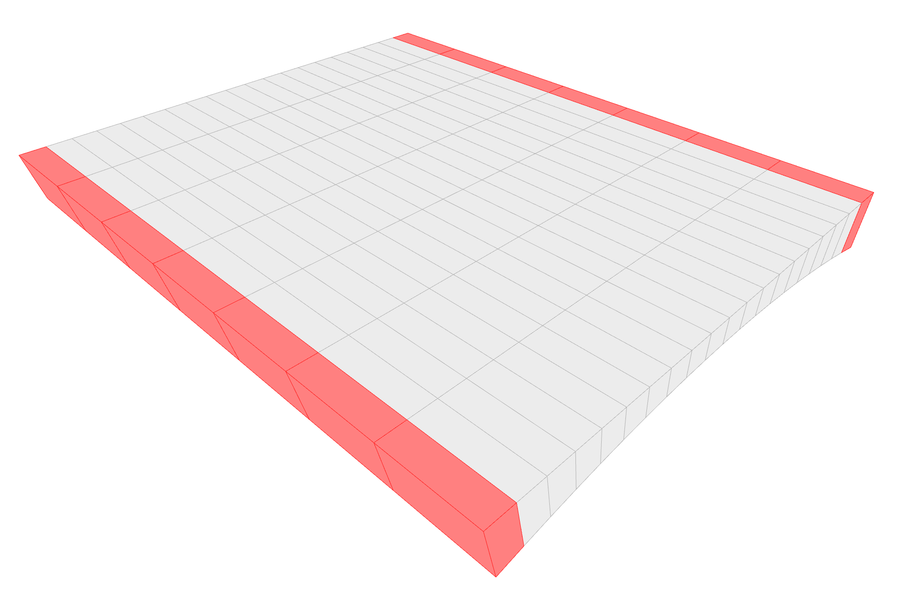
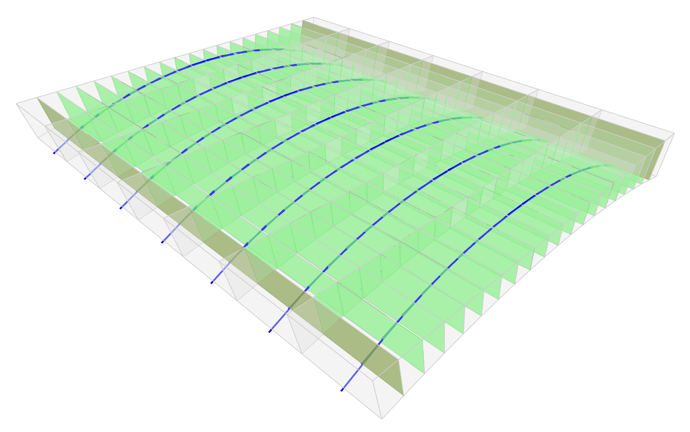
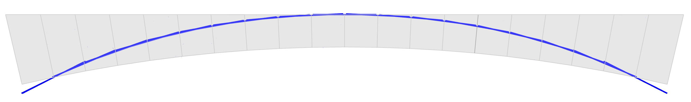

# 200 — Floor, No Stagger, Standard Blocks

**Session name:** `FloorNoStagStandardTest`  
**Folder:** `examples/workflows/testing_dem/200_floor_nostag_standard/`

## Goal

A flat barrel-vault floor (**6 m × 7.5 m**) built from a regular grid of plain `StandardBlock` voussoirs with no stagger between columns. This is the first workflow to exercise the **full TNA → geometry → DEM chain** for a real floor geometry.



## Concepts introduced

- **TNA with `FloorFormDiagram`** — computing the equilibrium vault shape from plan dimensions and target rise, rather than prescribing geometry analytically
- **`Pattern.from_barrelvault()`** — generating the combinatorial layout of radials and rings for a barrel vault
- **`RefMesh`** — the output of TNA: equilibrium surface storing node positions and edge force densities
- **`FlatBarrelTemplate`** — generating a rectangular voussoir grid fitted to the `RefMesh` surface, with flat block faces
- **`stagger_type = "none"`** — all block joints are aligned across columns (no bonding)
- **3D vault in a `BlockModel`** — assembling and solving a fully 3D vaulted floor geometry, as opposed to the 1D arch of example `100`

## Workflow steps

| Script | Stage | Description |
|--------|-------|-------------|
| `200_init.py` | X00 Init | Session, floor dimensions (6 m × 7.5 m × 0.5 m rise), block counts, TNA resolution |
| `210_tna.py` | X10 TNA | `Pattern` → `FloorFormDiagram` → `RefMesh` |
| `220_geometry.py` | X20 Geometry | `FlatBarrelTemplate` with `stagger_type="none"` → block meshes |
| `240_dem_model.py` | X40 DEM Model | `BlockModel`, `compute_contacts()` |
| `241_dem_problem.py` | X41 DEM Problem | `MohrCoulomb`, LMGC90 |
| `242_dem_viz.py` | X42 Visualisation | `DEMViewer`, contact force inspection |

## Key parameters (`200_init.py`)

```python
params = {
    "floor": {
        "height": 0.5,                  # vault rise [m]
        "thickness": 0.3,               # voussoir thickness [m]
        "voussoirs_count_span": 20,     # blocks along the span
        "voussoirs_count_length": 7,    # blocks along the vault length
        "stagger_type": "none",         # no column offset
        "stagger_amount": 0.0,
        "number_of_radials": 20,        # TNA form diagram nodes in span direction
        "number_of_rings": 30,          # TNA form diagram nodes in length direction
        "bottom_shell_thickness": 0.06,
        "horizontal_layer_thickness": 0.04,
        "minimum_layer_spacing": 0.05,
        "block_fill_percentage": 0.5,
        "density": 2.300,               # block material density [t/m³]
    },
    "grid": {"width": 6, "depth": 7.5, "height": 3.2},
    # ...
}
```

## What to observe

After running `210_tna.py`, inspect the `RefMesh` in the viewer. The surface should be a smooth barrel vault whose curvature is determined by the force density distribution: higher force density on the rib edges → more curved surface.

After running `241_dem_problem.py` and opening `242_dem_viz.py`, the contact force vectors should confirm that all forces are compressive and that the force flow follows the ribs of the vault.



