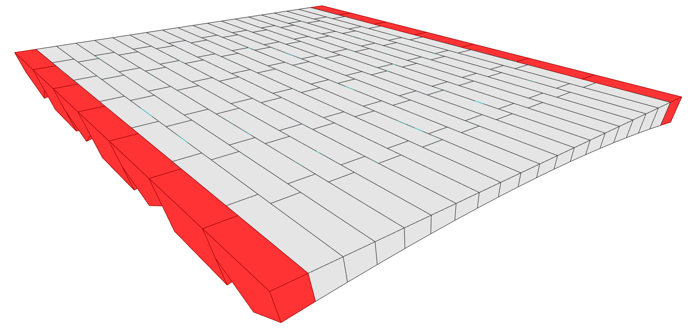

# 400 — Floor, Running Stagger, Ridge Voussoirs

**Session name:** `FloorStagRidgeTest`  
**Folder:** `examples/workflows/testing_dem/400_floor_stag_ridge/`

## Goal

Extends workflow `300` by replacing `StandardBlock` elements on selected vault columns with **`RidgeVoussoir` elements** — blocks that have a physical ridge feature along the intrados face. This introduces typed element differentiation within the same vault grid.



## Concepts introduced

- **`RefBlock`** — intermediate data structure carrying geometric reference frame and grid position; decouples block geometry from element type
- **`RidgeVoussoir`** — `StructuralElement` subclass adding an intrados ridge; instantiated via `RidgeVoussoir.from_refblock()`
- **`"feature_cols"` parameter** — list of column indices receiving `RidgeVoussoir`; all other columns get `StandardBlock`
- **Mixed-type `BlockModel`** — single model containing elements of different types; contacts detected correctly across type boundaries
- **`TrimModifier`** — applied at the tie-beam / support-voussoir interface to resolve geometric intersections

## Workflow steps

| Script | Stage | Description |
|--------|-------|-------------|
| `400_init.py` | X00 Init | Parameters + `"feature_cols": [0, 2, 4, 6]` |
| `410_tna.py` | X10 TNA | Same TNA as `310` |
| `420_geometry.py` | X20 Geometry | `FlatBarrelTemplate` → `block_meshes` + `block_frames` |
| `430_refblock.py` | X30 RefBlock | Build `RefBlock` objects; assign `RidgeVoussoir` to feature cols |
| `440_dem_model.py` | X40 DEM Model | `BlockModel` from typed elements |
| `441_dem_problem.py` | X41 DEM Problem | Solve |
| `442_dem_viz.py` | X42 Visualisation | View DEM results |
| `450_model_grid.py` | X50 Structural Grid | Frame (same as `350`) |
| `451_model_floor.py` | X51 Floor Assembly | Full `FloorModel` with ridge voussoirs |

## Key code: assigning element types

```python
feature_cols = params["floor"]["feature_cols"]   # [0, 2, 4, 6]
refblocks = session["refblocks"]

block_elements = []
for i in range(len(refblocks)):
    col_elements = []
    for j in range(len(refblocks[i])):
        rb = refblocks[i][j]
        is_support = (j == 0 or j == len(refblocks[i]) - 1)

        if i in feature_cols:
            element = RidgeVoussoir.from_refblock(rb, is_support=is_support, name=f"block_{i}_{j}")
        else:
            element = StandardBlock.from_refblock(rb, is_support=is_support, name=f"block_{i}_{j}")
        col_elements.append(element)
    block_elements.append(col_elements)
```

## What to observe

Comparing this workflow against `300` with the same floor geometry and load shows the effect of the ridge feature on the contact force distribution. The ridge introduces additional contact area at the inter-column joint, which changes how forces transfer between adjacent columns.

Diff `430_refblock.py` against the equivalent section in `500` to see exactly what changes when upgrading from `RidgeVoussoir` to `CarbcomnVoussoir`.
