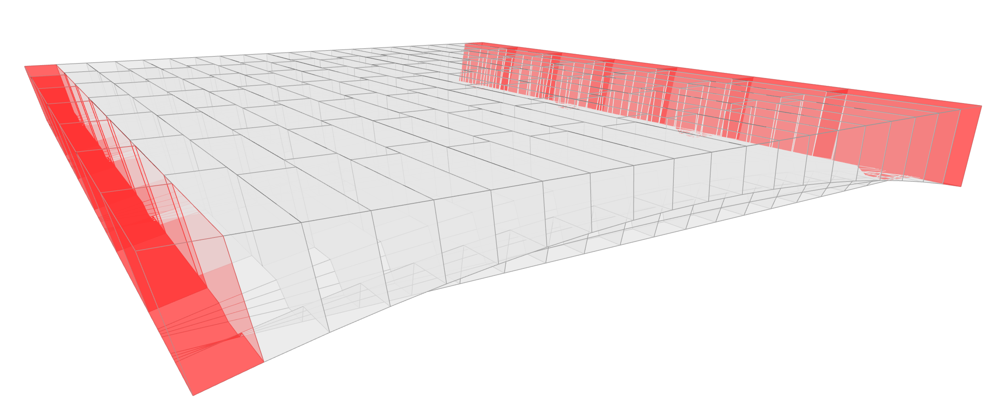

# 500 — Floor, Running Stagger, CARBCOMN Voussoirs

**Session name:** `FloorStagCarbcomnTest`  
**Folder:** `examples/workflows/testing_dem/500_floor_stag_carbcomn/`

## Goal

The most complete workflow in the current pipeline. It replaces the ridge voussoirs on selected columns with **`CarbcomnVoussoir` elements** — the project's signature block geometry, featuring an intrados slot and a post-tensioning cable channel. This workflow represents the **full CARBCOMN design pipeline** as currently implemented.



## Concepts introduced

- **`CarbcomnVoussoir`** — the complete CARBCOMN element: intrados ridge + slot + post-tensioning cable channel, parameterised by `intrados_halfwidth`, `cable_halfwidth`, `wall_resolution`
- **Full pipeline integration** — the `CarbcomnVoussoir` geometry is handled by the same `BlockModel` + `FloorModel` assembly chain as simpler workflows, demonstrating the element abstraction is solver-agnostic
- **Additional element parameters** — the `params["elements"]` dict includes CARBCOMN-specific geometry parameters alongside the standard column/beam dimensions

## Workflow steps

| Script | Stage | Description |
|--------|-------|-------------|
| `500_init.py` | X00 Init | Parameters + CARBCOMN element geometry params |
| `510_tna.py` | X10 TNA | Same as `410` |
| `520_geometry.py` | X20 Geometry | `FlatBarrelTemplate` |
| `530_refblock.py` | X30 RefBlock | Assign `CarbcomnVoussoir` to feature cols |
| `540_dem_model.py` | X40 DEM Model | `BlockModel` from typed elements |
| `541_dem_problem.py` | X41 DEM Problem | Solve |
| `542_dem_viz.py` | X42 Visualisation | View DEM results |
| `550_model_grid.py` | X50 Structural Grid | Frame |
| `551_model_floor.py` | X51 Floor Assembly | Full `FloorModel` |

## CARBCOMN-specific parameters

```python
params["elements"] = {
    "column_width": 0.2,
    "column_depth": 0.2,
    "beam_width": 0.3,
    "beam_depth": 0.5,
    # CARBCOMN voussoir geometry
    "intrados_halfwidth": 0.04,   # half-width of intrados slot / cable housing [m]
    "cable_halfwidth": 0.015,     # half-width of cable channel within slot [m]
    "wall_resolution": 8,         # number of faces on intrados wall curve
}
```

## Key code: CarbcomnVoussoir instantiation

```python
from carbcomn.model.elements.blocks.carbcomn_voussoir import CarbcomnVoussoir

element = CarbcomnVoussoir.from_refblock(
    refblock=rb,
    is_support=is_support,
    name=f"block_{i}_{j}",
)
```

Replacing `RidgeVoussoir` with `CarbcomnVoussoir` is the only change from workflow `400`. Everything else — TNA, geometry generation, model assembly, solver — remains identical.

## What to observe

This is the reference baseline for the full CARBCOMN floor system under self-weight. The contact force distribution on the `CarbcomnVoussoir` columns differs from the `RidgeVoussoir` case due to the slot geometry reducing the effective contact area on the intrados face.

> **Reminder:** Post-tensioning prestress is **not yet included** as an active load case. The cable channel geometry is present and correct, but the cable force contribution will be implemented in a future version of the pipeline. See [Scope and Disclaimer](../01_introduction/scope_and_disclaimer.md).
